# Kroniki Etherii

> Przeglądarkowa gra RPG dark fantasy, w której rozwijasz bohatera, kompletujesz wyposażenie, podejmujesz wyprawy, walczysz na arenie i zapisujesz własną historię w kronikach Etherii.

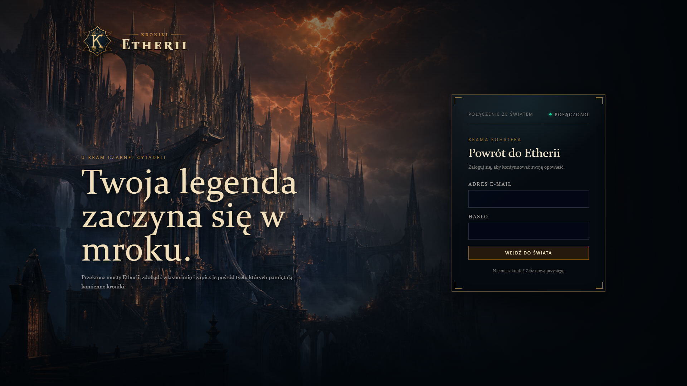

Kroniki Etherii łączą progresję znaną z klasycznych gier MMORPG z wygodnym interfejsem gry przeglądarkowej. Rozgrywka koncentruje się na rozwoju jednej postaci, zdobywaniu coraz lepszego ekwipunku, podejmowaniu decyzji moralnych oraz rywalizacji PvE i PvP.

## Najważniejsze funkcje

- rozwój bohatera: poziomy, doświadczenie, zdrowie, reputacja i punkty nauki,
- cztery podstawowe atrybuty: `STR`, `DEX`, `CON` i `INT`,
- rozbudowany plecak oraz 18 fizycznych miejsc wyposażenia,
- przedmioty o różnych rangach, rzadkościach i premiach do statystyk,
- targowisko z losową ofertą oraz katalog stałego kupca,
- Kowal: ulepszanie wyposażenia, odblokowywanie gniazd i osadzanie klejnotów,
- Jubiler: łączenie klejnotów i bezpieczne odzyskiwanie ich z przedmiotów,
- krótkie wyprawy PvE z wyborem moralnym i losowymi nagrodami,
- wieloetapowe, fabularne zlecenia w Karczmie pod Złamanym Gryfem,
- asynchroniczne pojedynki na arenie, ranking Koloseum i biegłość broni,
- bractwa, role członków oraz wojny pomiędzy gildiami,
- posiadłość rozwijana przez dziesięć poziomów,
- panel narzędzi testowych dla uprawnionych kont.

## Gra w działaniu

Poniższe zrzuty zostały wykonane bezpośrednio z aktualnej wersji aplikacji. Przedstawiają rzeczywisty interfejs, obecny zestaw modułów oraz dane rozwiniętego konta testowego.

### Twierdza - centrum dowodzenia

Twierdza zbiera najważniejsze informacje w jednym miejscu. Górna karta pokazuje bieżący priorytet bohatera, zdrowie, doświadczenie, skarbiec i reputację. Niżej znajdują się skróty do głównych aktywności, stan przygotowania postaci oraz faktyczne parametry bojowe wynikające z atrybutów i założonego wyposażenia.

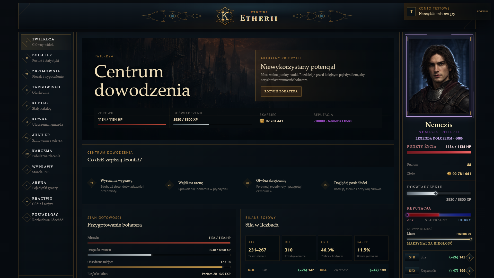

Stały panel po prawej stronie pozostaje dostępny podczas korzystania z modułów. Pokazuje portret, tytuł reputacji, rangę Koloseum, HP, złoto, postęp poziomu, biegłość aktywnej broni i najważniejsze statystyki.

### Bohater i fizyczne miejsca wyposażenia

Karta bohatera przedstawia sylwetkę otoczoną osiemnastoma rzeczywistymi miejscami na wyposażenie. Każdy slot można wybrać, aby zobaczyć pełne parametry przedmiotu, osadzone klejnoty i poziom ulepszenia. Kolor obramowania i poświaty odpowiada rzadkości elementu.

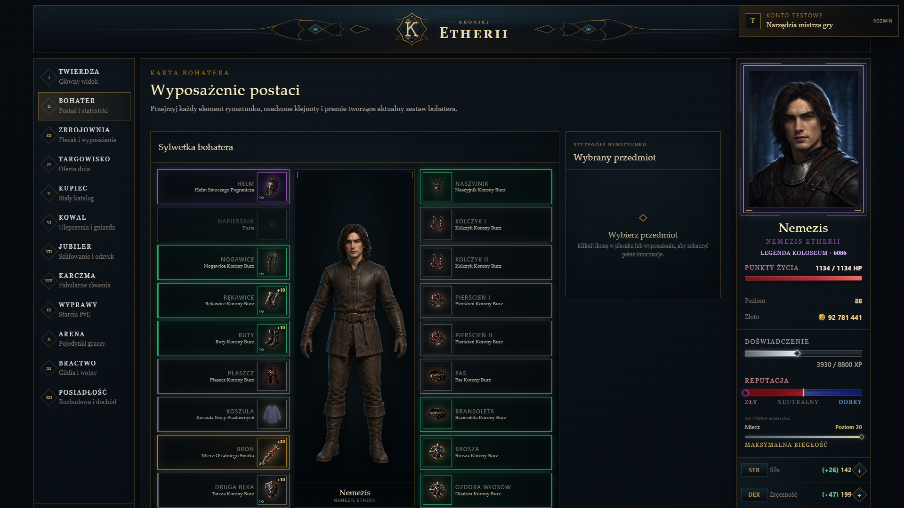

### Zbrojownia i plecak

Plecak korzysta ze zwartego układu znanego z klasycznych gier RPG. Pozwala wyszukiwać przedmioty po nazwie, filtrować je według rodzaju i rangi, zmieniać sposób sortowania oraz przełączać widok. Obok znajduje się podgląd kompletu wyposażenia, a wybrany przedmiot może zostać porównany z aktualnie założonym odpowiednikiem.

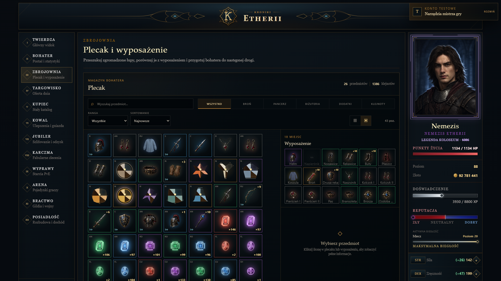

W tym samym magazynie są widoczne bronie, pancerze, biżuteria, dodatki i wszystkie posiadane klejnoty. Każdy egzemplarz zachowuje własny poziom ulepszenia oraz stan gniazd.

### Targowisko i Kupiec

Targowisko tworzy ograniczoną ofertę dnia z losowymi rabatami i szansą na rzadsze przedmioty. Karty nie są ukrywane, gdy bohater nie spełnia wymagań - gracz może obejrzeć wygląd, parametry, cenę oraz różnice względem własnego wyposażenia. Ofertę można odpłatnie odświeżyć do trzech razy dziennie.

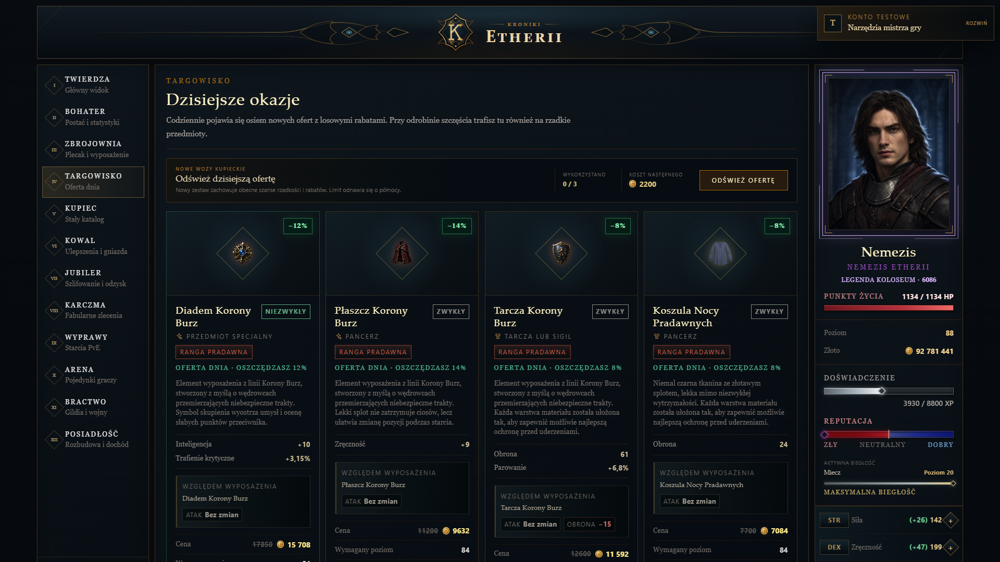

Kupiec udostępnia pełny, stały katalog. Pierwszy poziom nawigacji dzieli przedmioty na broń, pancerze, biżuterię i dodatki, a kolejne widoki pozwalają przejść do konkretnej rangi i stronicowanej listy wyposażenia.

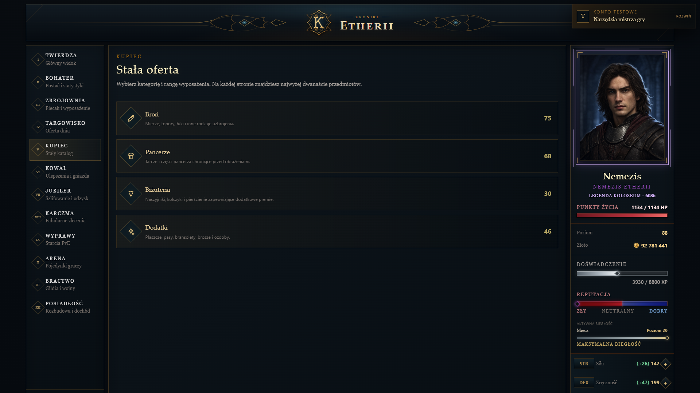

### Wyprawy PvE

Wyprawy są krótszą aktywnością PvE. System losuje jeden z pięciu stopni ryzyka, koszt zdrowia i skalowane nagrody. Posiadłość zwiększa szansę powodzenia, ilość zdobywanego złota oraz prawdopodobieństwo znalezienia przedmiotu, a wybór moralny przesuwa reputację bohatera.

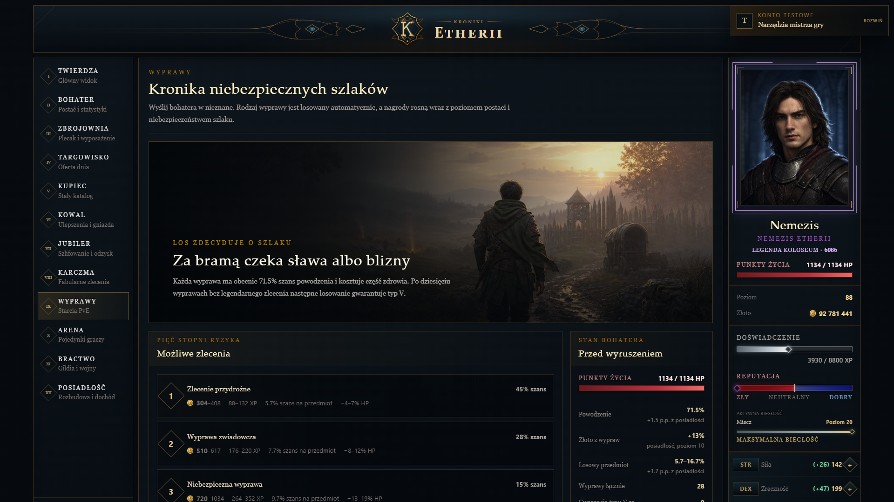

Po rozpoczęciu interfejs ustępuje miejsca pełnoekranowej sekwencji podróży. Teksty zmieniają się płynnie, pasek pokazuje postęp, a wynik i nagrody są odsłaniane kaskadowo.

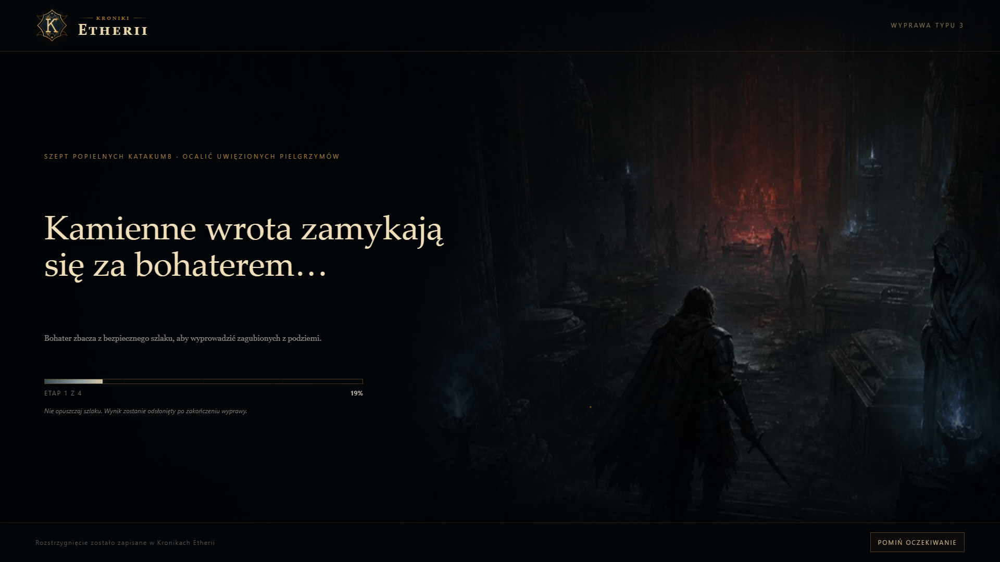

### Arena i Koloseum

Arena dobiera przeciwnika względem trwałego punktu odniesienia dla poziomu bohatera, więc zdobycie lepszego wyposażenia daje realnie odczuwalną przewagę. Gracz wybiera stronę konfliktu reputacji, porównuje statystyki obu postaci, może wylosować innego rywala i przed wejściem zna nagrodę oraz koszt kondycji.

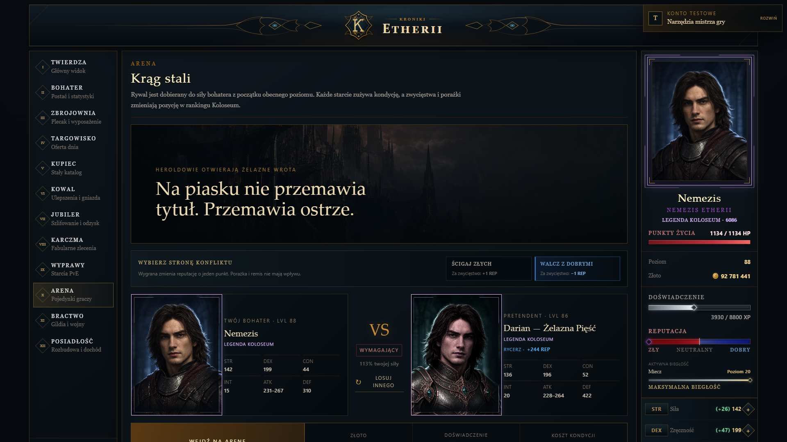

Pojedynek jest odtwarzany runda po rundzie. Silnik uwzględnia obrażenia broni, atak, obronę, celność, trafienia krytyczne i parowanie. Animowane komunikaty bojowe pojawiają się przy portretach, a cios kończący uruchamia osobny finisher. Wynik zmienia bilans zwycięstw, ranking Koloseum, reputację i biegłość używanej broni.

### Bractwa i wojny

Bractwo posiada własny sztandar, kronikę członków, role, panel dowództwa i listę dostępnych rywali. Przywódca może rozpocząć wojnę z inną gildią, a wynik konfliktu trafia do kroniki. Długie listy wojen są stronicowane, a operacje wymagające potwierdzenia korzystają z komunikatów osadzonych przy wykonywanej akcji.

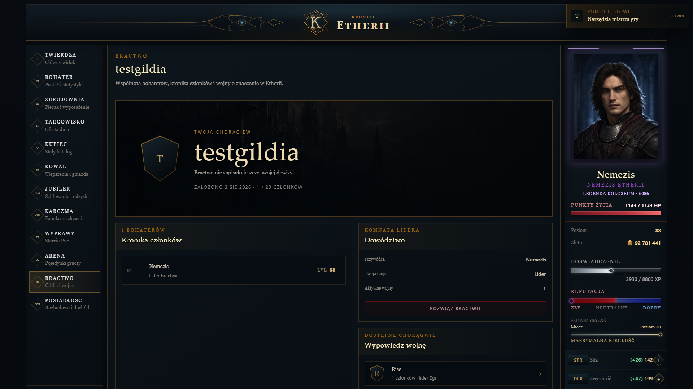

### Posiadłość

Posiadłość jest kosztowną inwestycją rozwijaną przez dziesięć poziomów. Każdy etap zmienia ilustrację siedziby i pokazuje korzyści następnej rozbudowy. Wyższy poziom przyspiesza pasywną regenerację HP, skraca czas oczekiwania na rytuał oraz stopniowo zwiększa powodzenie wypraw, zdobywane złoto i szansę na przedmiot.

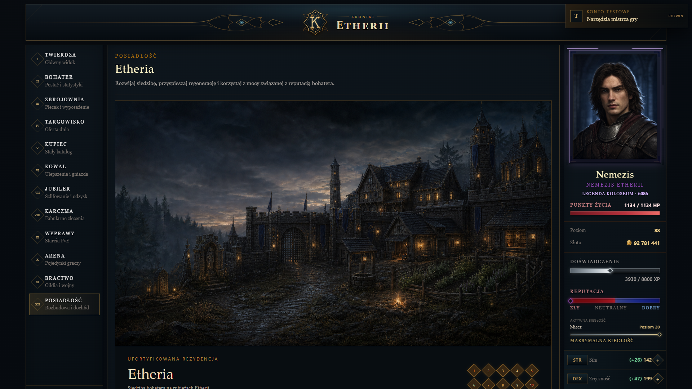

Rytuał odnawia zdrowie do pełna i ma własny czas odnowienia. Pasek HP pokazuje także, ile punktów przywróci następny tick regeneracji.

### Kowal - ulepszanie i gniazda

Kowal operuje na konkretnych egzemplarzach przedmiotów. Pozwala hartować wyposażenie, wykuwać gniazda oraz osadzać w nich klejnoty. Przed zatwierdzeniem gracz widzi koszt, szansę powodzenia i dokładną zmianę parametrów. Nieudana próba nie niszczy przedmiotu, a kolejne podejście otrzymuje premię do powodzenia.

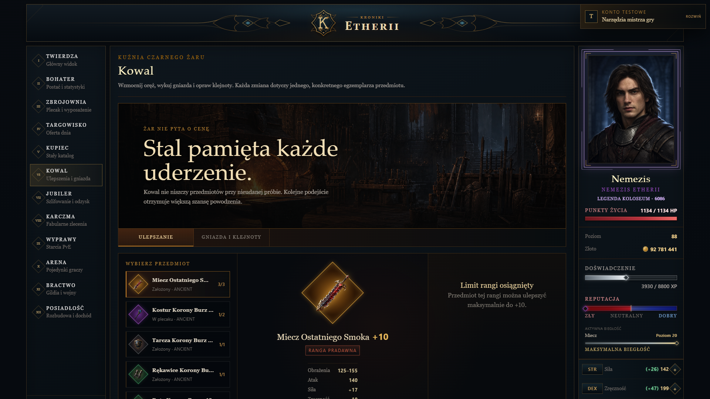

Poziom ulepszenia ma limit zależny od rangi wyposażenia, dzięki czemu przedmioty początkowe nie wymagają absurdalnie wysokiego poziomu bohatera, aby wykorzystać ich pełny potencjał.

### Jubiler - szlifowanie i odzyskiwanie

Jubiler rozwija osobną gospodarkę klejnotów. Trzy kamienie tej samej rodziny i szlifu można połączyć w jeden klejnot wyższego poziomu. Dostępne szlify mają własne kształty, od prostego okrągłego cięcia po prestiżowy szlif szmaragdowy.

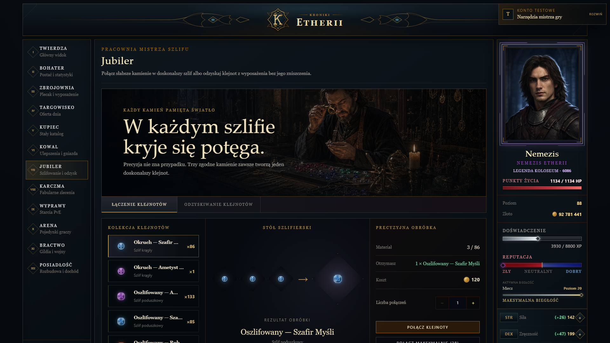

Druga część pracowni umożliwia bezpieczne odzyskanie osadzonego klejnotu. Interfejs wskazuje, które premie przedmiot utraci po zabiegu, a odzyskany kamień wraca do plecaka.

### Karczma pod Złamanym Gryfem

Karczma udostępnia wieloetapowe zlecenia fabularne oparte na Księdze Świata Etherii. Kontrakty prowadzą przez różne regiony, składają się z kolejnych scen i pozwalają odkrywać historię świata poprzez opisy wydarzeń, ślady, zeznania oraz spotkania z przeciwnikami. Decyzje gracza wpływają na przebieg zlecenia i jego zakończenie, a najważniejsze rezultaty są zapisywane w Kronice.

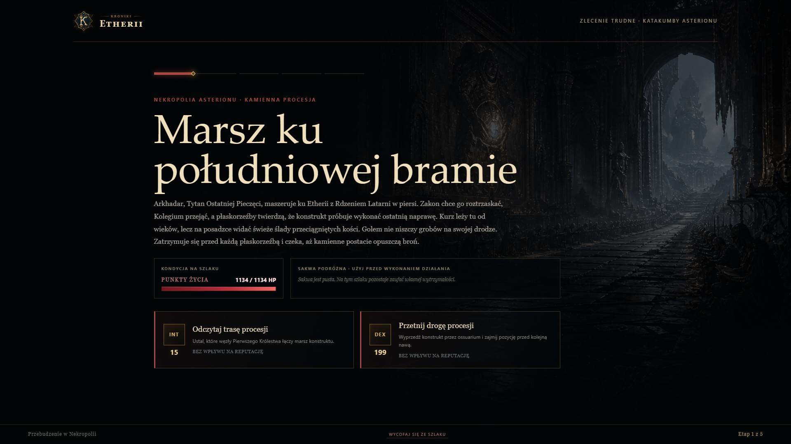

Zlecenia mogą zawierać:

- wybory zmieniające dalszy przebieg historii,
- próby `STR`, `DEX`, `CON` i `INT` rozstrzygane animowanym rzutem kości,
- interaktywne zagadki i minigry zręcznościowe,
- walki z unikatowymi przeciwnikami i finałowymi bossami,
- prowiant używany pomiędzy etapami,
- alternatywne zakończenia, relikty oraz trwałe wpisy w Kronice.

Zdrowie jest zachowywane pomiędzy etapami. Śmierć albo dobrowolna ucieczka kończy zlecenie porażką, a podczas aktywnego kontraktu nie można ominąć ryzyka przez regenerację w Posiadłości.

### Awans bohatera

Zdobycie poziomu uruchamia pełnoekranową celebrację inspirowaną klasycznymi grami fantasy. Ekran pokazuje nowy poziom, przyrost maksymalnego zdrowia, zdobyte punkty nauki oraz następny próg doświadczenia. Po awansie zdrowie bohatera zostaje odnowione do pełna.

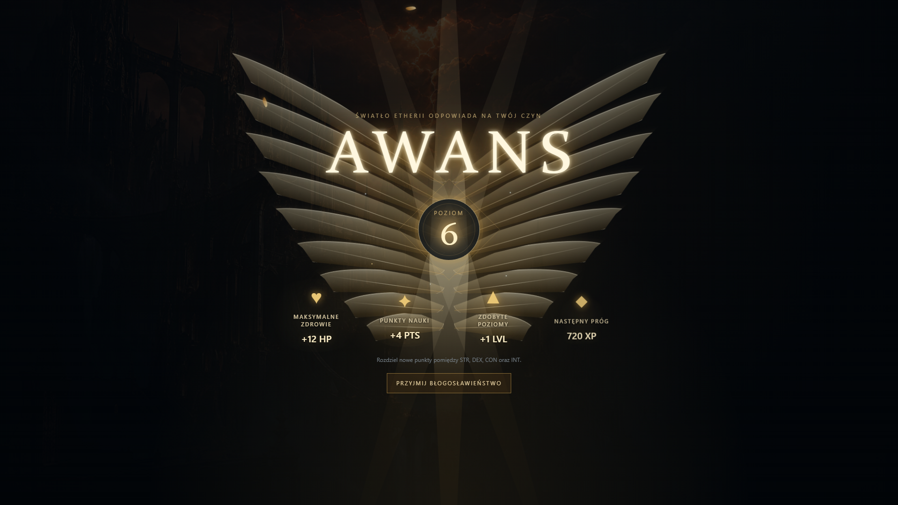

## Architektura

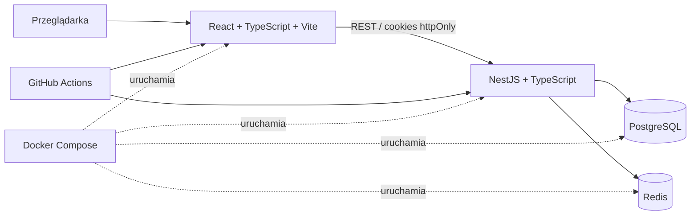

| Warstwa | Technologie |
|---|---|
| Frontend | React, TypeScript, Vite, Tailwind CSS, TanStack Query, Zustand |
| Backend | NestJS, TypeScript, Prisma ORM |
| Dane trwałe | PostgreSQL |
| Sesje i ograniczenia czasowe | Redis |
| Uwierzytelnianie | JWT w cookies `httpOnly`, rotacja tokenów, Argon2id |
| Testy | Jest |
| Środowisko | Docker Compose |
| Automatyzacja | GitHub Actions |

Kod frontendu ma architekturę feature-based. Warstwa prezentacji, komunikacja z API, komponenty współdzielone i typy domenowe pozostają rozdzielone, a `App.tsx` pełni wyłącznie funkcję punktu kompozycji aplikacji.

## Uruchomienie lokalne

### Wymagania

- Docker Desktop z obsługą `docker compose`,
- około 2 GB wolnej pamięci RAM,
- wolne porty `5173`, `3000`, `5432` i `6379`.

Nie trzeba instalować lokalnie Node.js, PostgreSQL ani Redis.

### Start projektu

```bash
cp .env.example .env
docker compose up --build
```

W systemie Windows plik można również skopiować ręcznie jako `.env`.

Po zbudowaniu kontenerów dostępne są:

- aplikacja: [http://localhost:5173](http://localhost:5173),
- API: [http://localhost:3000](http://localhost:3000),
- health-check: [http://localhost:3000/health](http://localhost:3000/health).

Przy pierwszym uruchomieniu backend wykonuje migracje i przygotowuje dane początkowe. Następnie należy utworzyć konto, zalogować się i nadać imię bohaterowi.

### Zatrzymanie projektu

```bash
docker compose down
```

Dane pozostaną zapisane w wolumenie Dockera. Aby usunąć również bazę i rozpocząć od czystego stanu:

```bash
docker compose down -v
```

## Praca bez Dockera

```bash
# Backend
cd backend
npm install
npx prisma generate
npm run start:dev

# Frontend - w drugim terminalu
cd frontend
npm install
npm run dev
```

Lokalne polecenia Prisma wymagają osobnego pliku `backend/.env`, w którym host bazy to `localhost`, a nie nazwa usługi `postgres` używana wewnątrz Docker Compose.

## Testy i jakość

```bash
# Testy backendu w uruchomionym środowisku
docker compose exec backend npm test -- --runInBand

# Produkcyjna kompilacja frontendu
docker compose exec frontend npm run build

# Test obciążeniowy endpointu health-check
docker compose exec backend npm run loadtest:smoke
```

Workflow CI znajduje się w [`.github/workflows/ci.yml`](.github/workflows/ci.yml) i automatyzuje kontrolę projektu przy zmianach w repozytorium.

## Bezpieczeństwo

- hasła skracane przy użyciu Argon2id,
- krótko żyjący access token i rotowany refresh token,
- tokeny przechowywane w cookies `httpOnly`,
- globalna walidacja DTO i odrzucanie nadmiarowych pól,
- ograniczanie częstotliwości żądań dla wrażliwych endpointów,
- CORS ograniczony do skonfigurowanego frontendu,
- soft delete kont użytkowników.

## Status projektu

Projekt jest aktywnie rozwijany. Aktualny zakres tworzy grywalną pętlę: rozwój bohatera → zdobywanie wyposażenia → ulepszanie przedmiotów → wyprawy i zlecenia → arena oraz rywalizacja bractw → rozwój posiadłości.
