# Kroniki Etherii

> Przeglądarkowa gra RPG dark fantasy, w której rozwijasz bohatera, kompletujesz wyposażenie, podejmujesz wyprawy, walczysz na arenie i zapisujesz własną historię w kronikach Etherii.

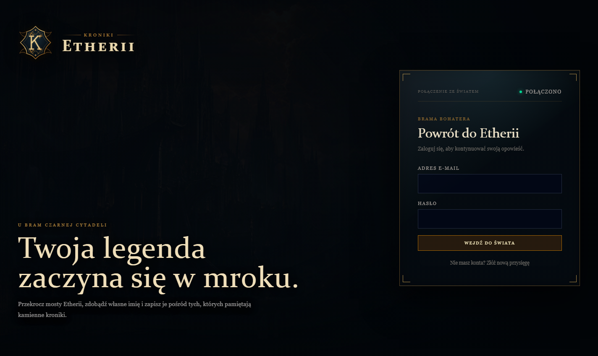

Kroniki Etherii łączą progresję znaną z klasycznych gier MMORPG z wygodnym interfejsem gry przeglądarkowej. Rozgrywka koncentruje się na rozwoju jednej postaci, zdobywaniu coraz lepszego ekwipunku, podejmowaniu decyzji moralnych oraz rywalizacji PvE i PvP.

## Najważniejsze funkcje

- rozwój bohatera: poziomy, doświadczenie, zdrowie, reputacja i punkty nauki,
- cztery podstawowe atrybuty: `STR`, `DEX`, `CON` i `INT`,
- rozbudowany plecak oraz 18 fizycznych miejsc wyposażenia,
- przedmioty o różnych rangach, rzadkościach i premiach do statystyk,
- targowisko z losową ofertą oraz katalog stałego kupca,
- Kowal: ulepszanie wyposażenia, odblokowywanie gniazd i osadzanie klejnotów,
- Jubiler: łączenie klejnotów i bezpieczne odzyskiwanie ich z przedmiotów,
- krótkie wyprawy PvE z wyborem moralnym i losowymi nagrodami,
- wieloetapowe, fabularne zlecenia w Karczmie pod Złamanym Gryfem,
- asynchroniczne pojedynki na arenie, ranking Koloseum i biegłość broni,
- bractwa, role członków oraz wojny pomiędzy gildiami,
- posiadłość rozwijana przez dziesięć poziomów,
- panel narzędzi testowych dla uprawnionych kont.

## Gra w działaniu

### Twierdza i rozwój bohatera

Twierdza jest centrum dowodzenia gracza. Zawiera najważniejsze informacje o stanie bohatera: poziom, doświadczenie, złoto, zdrowie, reputację oraz aktualne wartości bojowe. Stały panel postaci pozwala kontrolować progres bez opuszczania bieżącego modułu.

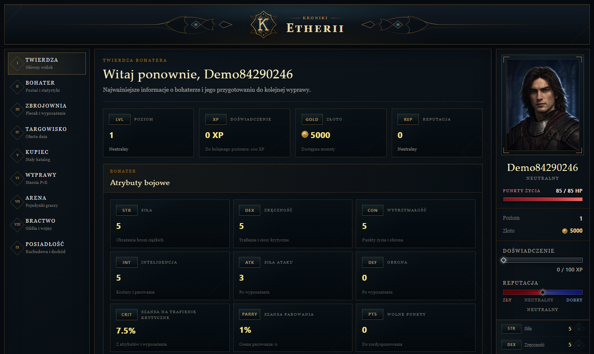

Po zdobyciu odpowiedniej liczby punktów doświadczenia pojawia się pełnoekranowa celebracja awansu. Gracz od razu widzi nowy poziom, przyrost maksymalnego zdrowia, zdobyte punkty nauki i kolejny próg doświadczenia.

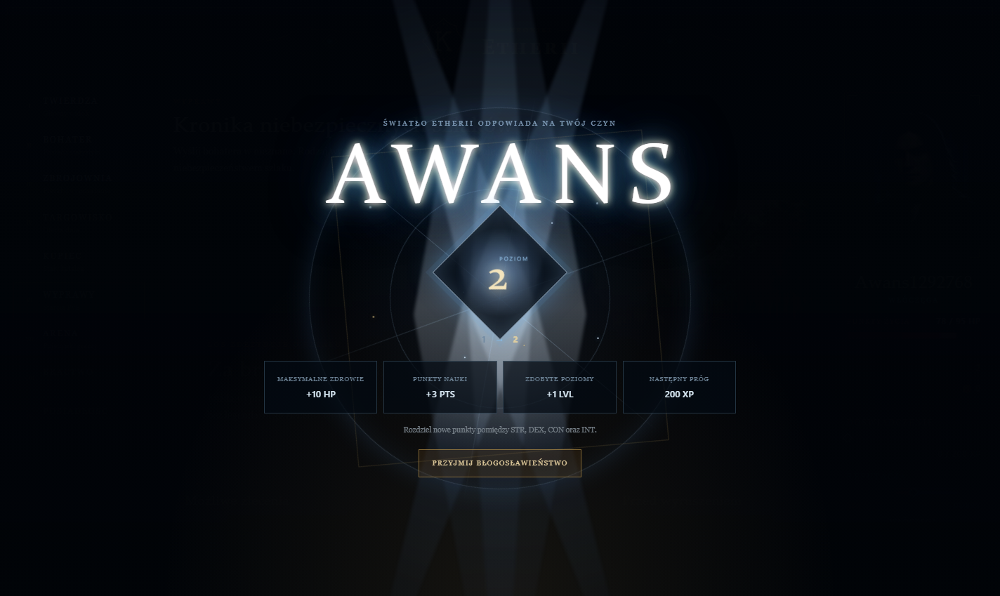

### Plecak i wyposażenie

Zbrojownia obsługuje wszystkie fizyczne miejsca wyposażenia postaci. Założone przedmioty wpływają na rzeczywiste statystyki bojowe, a zastępowany element automatycznie wraca do plecaka. System rozróżnia między innymi broń, drugą rękę, pancerz, biżuterię oraz przedmioty specjalne.

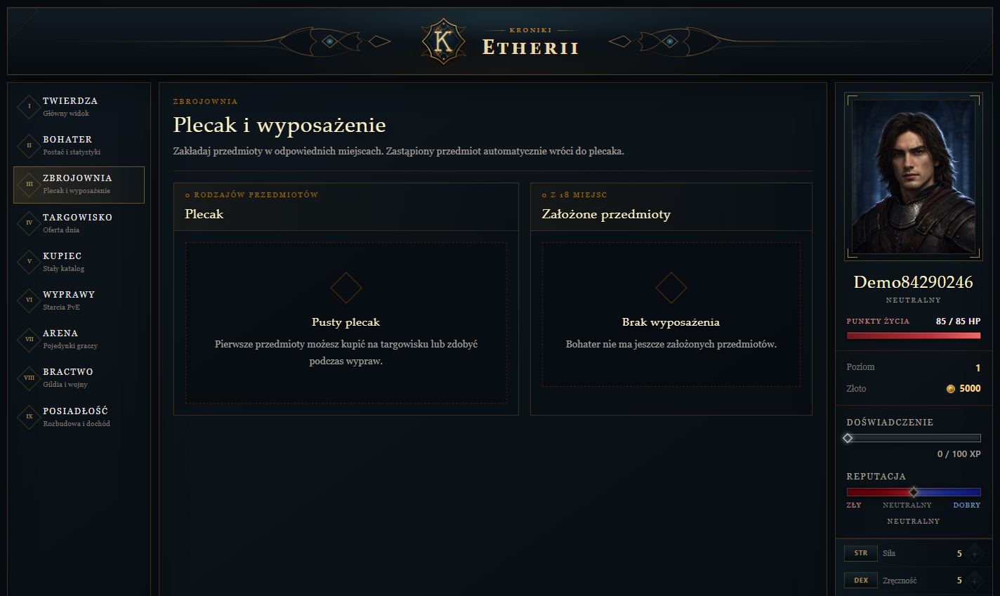

Aktualna wersja rozszerza ten moduł o:

- wyszukiwanie, sortowanie i filtrowanie przedmiotów,
- porównanie przedmiotu z aktualnie używanym wyposażeniem,
- wizualne oznaczenie rzadkości,
- indywidualne grafiki broni, pancerzy i biżuterii,
- poziomy ulepszenia oraz gniazda na klejnoty.

### Targowisko i kupiec

Targowisko przedstawia ograniczoną, losowaną ofertę dnia. Przedmioty mogą otrzymywać rabaty, a wyższe rzadkości pojawiają się odpowiednio rzadziej. Ofertę można odpłatnie odświeżyć maksymalnie trzy razy dziennie.

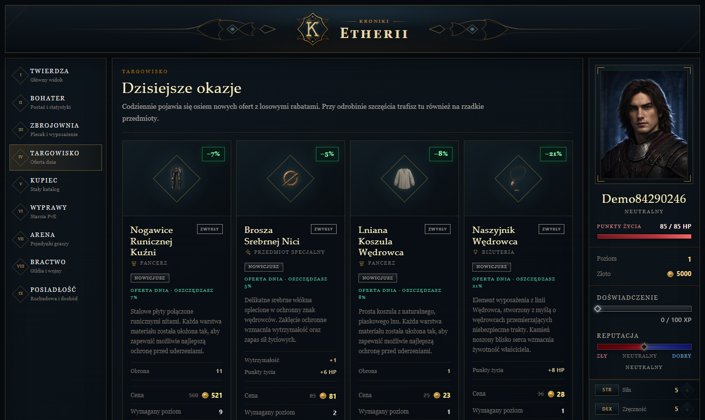

Kupiec udostępnia stały katalog wyposażenia. Przedmioty są podzielone według kategorii oraz rangi, a paginacja zapobiega jednoczesnemu renderowaniu całej bazy przedmiotów.

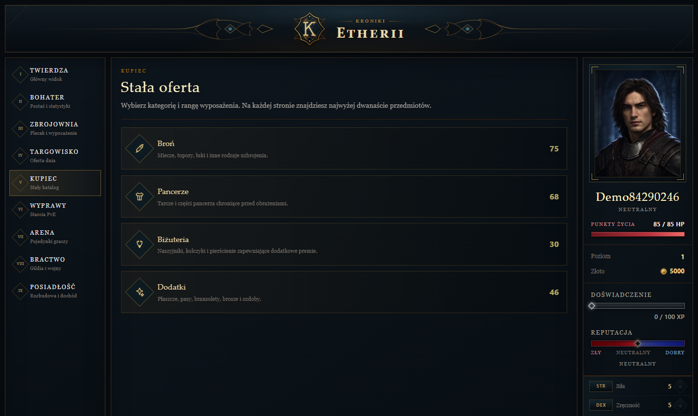

### Wyprawy PvE

Wyprawy to krótkie aktywności PvE o losowanej trudności. Każde zlecenie ma własny opis, szansę powodzenia, koszt zdrowia oraz skalowane nagrody w złocie i doświadczeniu. Decyzja moralna przesuwa reputację bohatera w stronę dobra albo zła.

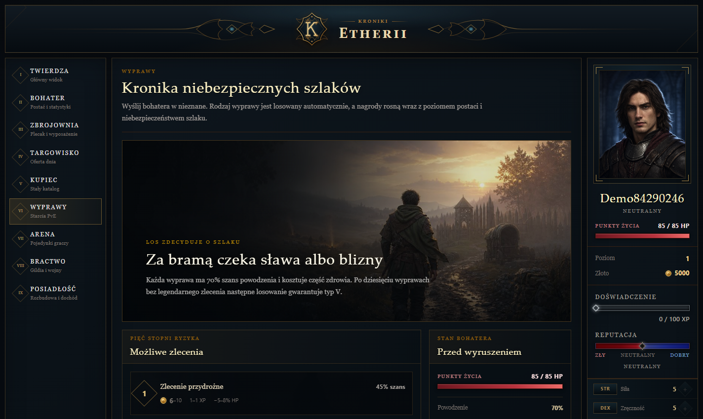

Przebieg wyprawy jest prezentowany jako animowana sekwencja, a wynik oraz nagrody pojawiają się kaskadowo. Bohater z niebezpiecznie niskim poziomem zdrowia nie może wyruszyć na szlak.

### Arena i Koloseum

Arena dobiera przeciwnika o zbliżonym poziomie, ale nie skaluje go bezpośrednio do każdego nowego elementu wyposażenia gracza. Dzięki temu rozwój postaci daje zauważalną przewagę. Przed walką można porównać podstawowe statystyki obu stron.

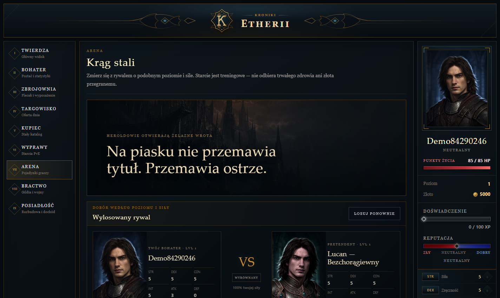

Walka jest odtwarzana runda po rundzie i wykorzystuje wspólny silnik obrażeń, trafień krytycznych, parowania oraz celności. Zwycięstwa i porażki zmieniają ranking Koloseum, odblokowują kolejne tytuły oraz rozwijają biegłość używanego rodzaju broni.

### Bractwa i wojny gildii

Gracz może założyć własne bractwo lub dołączyć do istniejącego. System obsługuje role członków, wspólną salę oraz historię działań gildii.

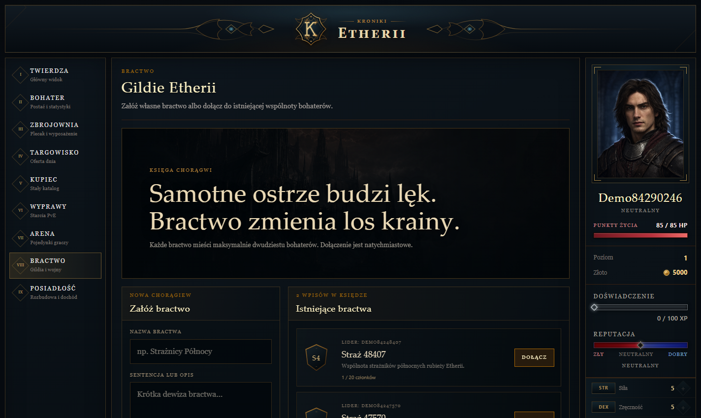

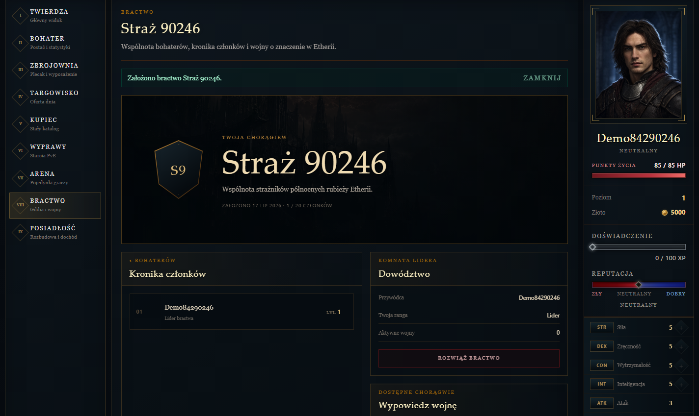

Przywódcy mogą wypowiadać wojny innym bractwom. Wynik konfliktu trafia do kroniki, a zwycięska gildia otrzymuje przewidzianą nagrodę.

### Posiadłość

Posiadłość jest kosztowną, długoterminową inwestycją. Przed zakupem gracz poznaje wymagania oraz podstawowe korzyści wynikające z jej posiadania.

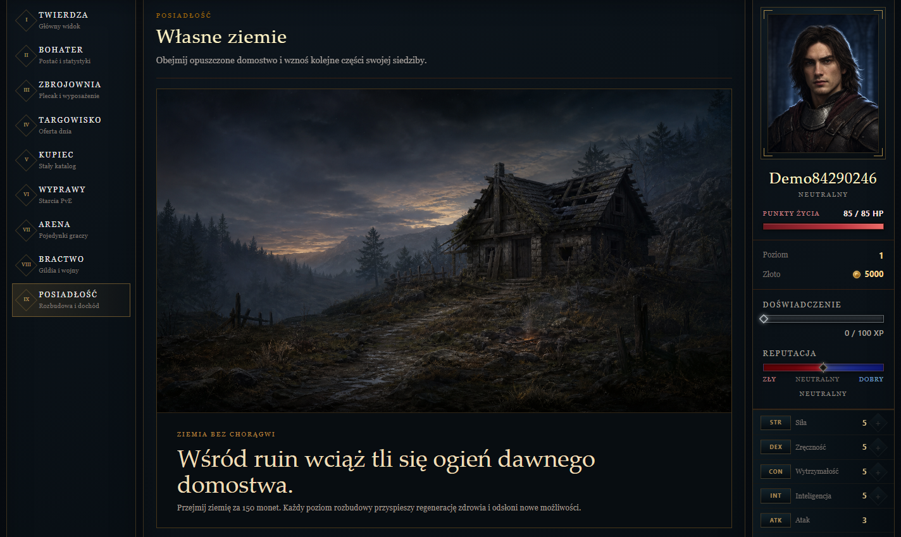

Każdy z dziesięciu poziomów zmienia ilustrację majątku i wzmacnia jego działanie. Posiadłość przyspiesza regenerację zdrowia, skraca czas oczekiwania na rytuał oraz zapewnia niewielkie premie do powodzenia wypraw, zdobywanego złota i szansy na przedmiot.

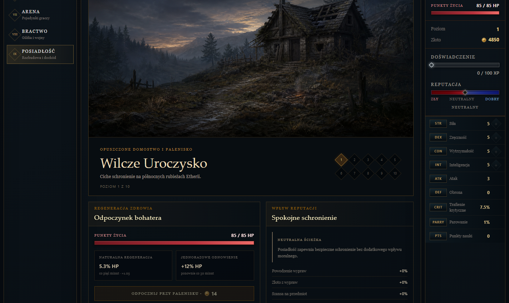

### Kowal, klejnoty i Jubiler

Kowal rozwija konkretny egzemplarz przedmiotu — ulepsza jego parametry, odblokowuje gniazda i osadza wybrane klejnoty. Interfejs pokazuje przewidywaną zmianę statystyk jeszcze przed zatwierdzeniem operacji.

Jubiler uzupełnia ten system. Trzy identyczne klejnoty można połączyć w jeden kamień wyższego szlifu, natomiast osadzony klejnot da się bezpiecznie odzyskać za odpowiednią opłatą. Każda rodzina kamieni zapewnia inny rodzaj premii.

### Karczma pod Złamanym Gryfem

Karczma oferuje osobny system rozbudowanych zleceń fabularnych. Tablica przedstawia kontrakty łatwe, średnie i trudne, a każda historia składa się z kilku etapów:

1. decyzji wpływających na przebieg zlecenia,
2. prób atrybutów rozstrzyganych rzutem kości,
3. interaktywnych zagadek i minigier,
4. walk ze stworzeniami kanonicznego bestiariusza,
5. alternatywnych zakończeń oraz wpisu w Kronice.

Prowiant kupiony u Miry można wykorzystać wyłącznie pomiędzy etapami zadania. Stan zdrowia jest zachowywany przez cały kontrakt, a śmierć lub ucieczka kończy zlecenie porażką.

## Architektura

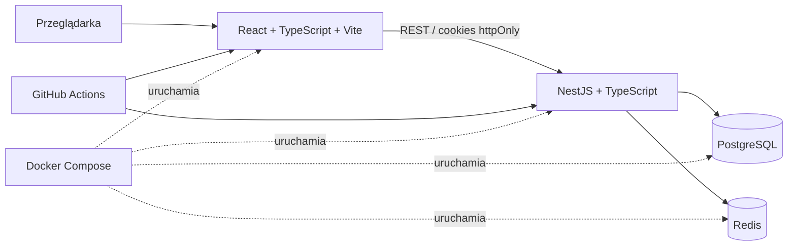

| Warstwa | Technologie |
|---|---|
| Frontend | React, TypeScript, Vite, Tailwind CSS, TanStack Query, Zustand |
| Backend | NestJS, TypeScript, Prisma ORM |
| Dane trwałe | PostgreSQL |
| Sesje i ograniczenia czasowe | Redis |
| Uwierzytelnianie | JWT w cookies `httpOnly`, rotacja tokenów, Argon2id |
| Testy | Jest |
| Środowisko | Docker Compose |
| Automatyzacja | GitHub Actions |

Kod frontendu ma architekturę feature-based. Warstwa prezentacji, komunikacja z API, komponenty współdzielone i typy domenowe pozostają rozdzielone, a `App.tsx` pełni wyłącznie funkcję punktu kompozycji aplikacji.

## Uruchomienie lokalne

### Wymagania

- Docker Desktop z obsługą `docker compose`,
- około 2 GB wolnej pamięci RAM,
- wolne porty `5173`, `3000`, `5432` i `6379`.

Nie trzeba instalować lokalnie Node.js, PostgreSQL ani Redis.

### Start projektu

```bash
cp .env.example .env
docker compose up --build
```

W systemie Windows plik można również skopiować ręcznie jako `.env`.

Po zbudowaniu kontenerów dostępne są:

- aplikacja: [http://localhost:5173](http://localhost:5173),
- API: [http://localhost:3000](http://localhost:3000),
- health-check: [http://localhost:3000/health](http://localhost:3000/health).

Przy pierwszym uruchomieniu backend wykonuje migracje i przygotowuje dane początkowe. Następnie należy utworzyć konto, zalogować się i nadać imię bohaterowi.

### Zatrzymanie projektu

```bash
docker compose down
```

Dane pozostaną zapisane w wolumenie Dockera. Aby usunąć również bazę i rozpocząć od czystego stanu:

```bash
docker compose down -v
```

## Praca bez Dockera

```bash
# Backend
cd backend
npm install
npx prisma generate
npm run start:dev

# Frontend — w drugim terminalu
cd frontend
npm install
npm run dev
```

Lokalne polecenia Prisma wymagają osobnego pliku `backend/.env`, w którym host bazy to `localhost`, a nie nazwa usługi `postgres` używana wewnątrz Docker Compose.

## Testy i jakość

```bash
# Testy backendu w uruchomionym środowisku
docker compose exec backend npm test -- --runInBand

# Produkcyjna kompilacja frontendu
docker compose exec frontend npm run build

# Test obciążeniowy endpointu health-check
docker compose exec backend npm run loadtest:smoke
```

Workflow CI znajduje się w [`.github/workflows/ci.yml`](.github/workflows/ci.yml) i automatyzuje kontrolę projektu przy zmianach w repozytorium.

## Bezpieczeństwo

- hasła skracane przy użyciu Argon2id,
- krótko żyjący access token i rotowany refresh token,
- tokeny przechowywane w cookies `httpOnly`,
- globalna walidacja DTO i odrzucanie nadmiarowych pól,
- ograniczanie częstotliwości żądań dla wrażliwych endpointów,
- CORS ograniczony do skonfigurowanego frontendu,
- soft delete kont użytkowników.

## Status projektu

Projekt jest aktywnie rozwijany. Aktualny zakres tworzy grywalną pętlę: rozwój bohatera → zdobywanie wyposażenia → ulepszanie przedmiotów → wyprawy i zlecenia → arena oraz rywalizacja bractw → rozwój posiadłości.
